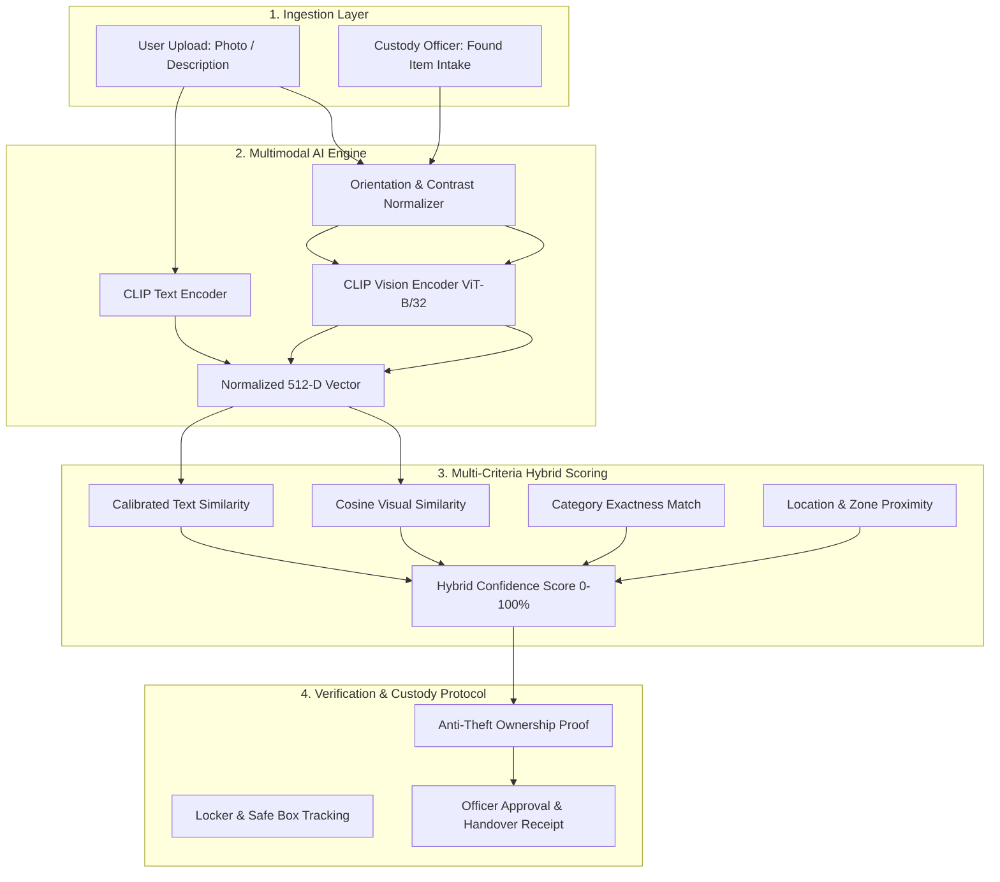

# 🔎 FindSphere — Campus & Transit AI Lost & Found Recovery Network

[](https://fastapi.tiangolo.com)
[](https://streamlit.io)
[](https://pytorch.org)
[](https://github.com/openai/CLIP)

An intelligent, production-ready Lost & Found recovery platform designed for universities, transit authorities, airports, and corporate complexes. Utilizing **OpenAI CLIP multimodal vision embeddings** and **multi-criteria hybrid scoring**, FindSphere automatically connects lost valuables with verified owners while preventing fraudulent claims.

---

## 🏛️ Real-World Problem & Solution

In colleges, hospitals, transit terminals, and public venues, thousands of lost items are deposited into security lockers each month. Traditional recovery workflows fail because:
- **Manual logbooks** are difficult to search by physical appearance.
- **Text descriptions are subjective** (one person says *"dark grey pouch"*, another says *"black pencil case"*).
- **Public registries risk theft**: anyone can see lost items and fraudulently claim them without proof.

### The FindSphere Solution:
1. **Multimodal Visual Matching**: Upload an image or enter a natural language description. CLIP extracts a 512-dimensional semantic vector and ranks candidate items by visual and semantic similarity.
2. **Anti-Theft Verification Protocol**: High-value hallmarks (serial numbers, engravings, lockscreen images, interior pocket contents) are hidden from the public. Claimants must answer an encrypted verification prompt before custody release is authorized.
3. **Automated Reverse-Match Listener**: When a security officer registers a newly found item, the system automatically cross-references all open lost reports and dispatches alert notifications to potential owners.
4. **Dual Interface**:
   - **Weblium-Style Web Portal**: Clean, human-crafted responsive web interface with zero AI clichés.
   - **Streamlit Command Studio**: Interactive dashboard for custody desk staff and security administrators.

---

## 📊 System Architecture



---

## 🗄️ Curated Dataset & Scaling Strategy

The platform includes a pre-cataloged dataset of **28+ real-world items** stored in `data/` across five high-frequency lost categories:

| Category | Example Brands & Items | Typical Custody Locations |
| :--- | :--- | :--- |
| **Backpacks & Bags** | Herschel Classic, JanSport SuperBreak, SwissGear, Nike Brasilia | Library Quiet Rooms, Lecture Halls, Transit Hub |
| **Phones & Electronics** | iPhone 14 Pro, Samsung Galaxy S23, Google Pixel 8 | Cafeteria Register, Study Desks, Labs |
| **Wallets & Cards** | Bellroy Bi-Fold, Fossil RFID, Ridge Aluminum, Tommy Hilfiger | ATM Kiosks, Dining Halls, Parking Stands |
| **Watches & Wearables** | Apple Watch Series 8, Casio Vintage Illuminator, Fossil Grant | Gymnasiums, Sports Arenas, Music Rooms |
| **Bottles & Thermoses** | Hydro Flask 32oz, Stanley Quencher 40oz, YETI Rambler | Science Labs, Workshop Desks, Auditoriums |

### Recommended Real-World Open Datasets for Scaling:
- **Stanford Online Products (SOP)**: ~120k product images for fine-grained retrieval benchmarking.
- **Amazon Berkeley Objects (ABO)**: ~150k multi-angle product photographs with structured catalog metadata.
- **COCO (Common Objects in Context)**: 80 common object classes for bounding-box detection and auto-cropping.

---

## 🚀 Quickstart Guide

### 1. Installation
Clone the repository and install requirements:
```bash
git clone https://github.com/chandolupraneethkumar05-oss/AI-Lost-Found-Matcher.git
cd AI-Lost-Found-Matcher

# Create and activate virtual environment
python -m venv venv
.\venv\Scripts\activate   # On Windows
source venv/bin/activate  # On Linux/macOS

# Install dependencies
pip install -r requirements.txt
```

### 2. Launch the Weblium-Inspired Web Portal (Recommended)
```bash
python server.py
```
Open **[http://localhost:8000](http://localhost:8000)** in your browser.

### 3. Or Launch the Streamlit Admin Studio
```bash
streamlit run app.py
```
Open **[http://localhost:8501](http://localhost:8501)** in your browser.

---

## 🌐 REST API Endpoints

The FastAPI backend (`server.py`) provides full REST API capabilities:

| Method | Endpoint | Description |
| :--- | :--- | :--- |
| `POST` | `/api/match` | Upload image and/or text to perform hybrid multimodal search |
| `GET` | `/api/items` | Retrieve filterable catalog items (`category`, `location`, `search`) |
| `GET` | `/api/items/{id}` | Retrieve specific item metadata |
| `POST` | `/api/report-found` | Intake found item, compute embedding, check reverse lost matches |
| `POST` | `/api/report-lost` | File lost inquiry and scan existing custody inventory |
| `POST` | `/api/claim` | Submit ownership claim with anti-theft verification proof |
| `GET` | `/api/claims` | List submitted claims for custody officer review |
| `POST` | `/api/claims/{id}/verify` | Approve or reject claim and issue handover status |
| `GET` | `/api/stats` | Live system statistics (recovery rate, custody count, avg time) |

---

## 🔒 Anti-Theft Verification Protocol

To prevent fraudulent claims:
1. Public listings display the item photograph and general location, but **omit specific unique identifiers** (serial number digits, internal pocket contents, lockscreen wallpaper).
2. When claiming an item, the user must answer a specific **Verification Prompt**.
3. A campus custody officer cross-checks the claimant's answer against the physical item or sealed note before handing over the valuable.

---

## 📁 Repository Structure

```
AI_Lost_Found/
├── app.py                      # Modernized Streamlit Command Studio
├── server.py                   # Production FastAPI server & REST API
├── requirements.txt            # Project dependencies
├── README.md                   # Comprehensive documentation
├── data/
│   ├── database.json           # Centralized database (items, reports, claims)
│   ├── found_items/            # Categorized catalog image directory
│   ├── registered_items/       # Newly registered custody uploads
│   └── test_images/            # Reference testing images
├── models/
│   └── image_embeddings.pkl    # Precomputed CLIP feature vectors
├── src/
│   ├── ai_engine.py            # Multimodal CLIP matching & hybrid scoring
│   ├── database.py             # Database persistence & claim management
│   ├── dataset_catalog.py      # Dataset ingestion & embedding precomputation
│   ├── embeddings.py           # Legacy embedding compatibility module
│   └── matcher.py              # Legacy matcher compatibility module
└── static/
    ├── index.html              # Weblium-style institutional web portal
    ├── style.css               # Classic slate/navy styling system
    └── app.js                  # Dynamic client-side controller
```

---

## 📄 License
This project is open-source under the [MIT License](LICENSE).